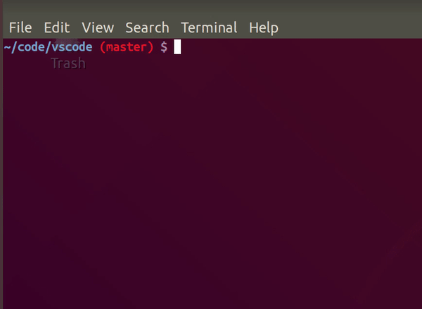

# Branch search

A simple terminal branch search for git

## Command line args

`bs` accepts the following command line arguments:

- `-p`: It checkouts to the selected branch and executes a `git pull`
    immediately afterwards.

- `-u`: It executes a `git fetch` _before_ showing the branches to be selected. It's useful to update branches before diplay.

- `[regex]`: If provided, a `git checkout` is immediately performed to a branch matching the regex. For instance, `bs maste` will most likely switch to `master`.

## Dependencies

The only dependency you may have to install is `ncurses`. You can read
how to install it in most distros in [this tutorial](https://www.osetc.com/en/how-to-install-ncurse-library-in-ubuntu-debian-centos-fedora-linux.html).

## Install

You can install branchsearch by cloning the repo:

`git clone https://github.com/npazosmendez/branchsearch.git`

Go into the repository's folder and run (if you want it automatically installed):

`sudo make install`

Otherwise you may run

`make`

and copy the generated exectable (`bs`) to your preferred location.

#### Disclaimer

Suboptimal in many ways, but more than enough for what I need.

## FAQ

- This could have been a simple python script

First of all, how dare you. Secondly, that's not even a question. A python script wouldn't be as fun.
